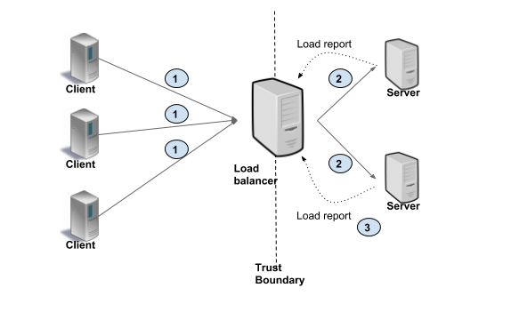
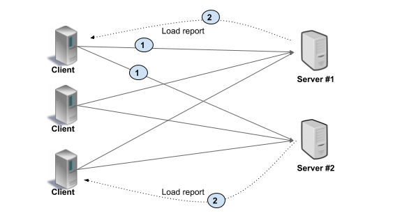

## Introduction

This document describes various load balancing scenarios seen when deploying gRPC. If you use [gRPC](http://grpc.io) with multiple backends, this document is for you.

A large scale gRPC deployment typically has a number of identical back-end instances, and a number of clients. Each server has a certain capacity. Load balancing is used for distributing the load from clients optimally across available servers.

### Why gRPC?

As a reminder, gRPC is a modern RPC protocol implemented on top of HTTP/2. HTTP/2 is a Layer 7 (Application layer) protocol, that runs on top of a TCP (Layer 4 - Transport layer) protocol, which runs on top of IP (Layer 3 - Network layer) protocol. gRPC has many [advantages](https://http2.github.io/faq/#why-is-http2-binary) over traditional HTTP/REST/JSON mechanism such as

1. Binary protocol (HTTP/2), 

2. Multiplexing many requests on one connection (HTTP/2)

3. Header compression (HTTP/2)

4. Strongly typed service and message definition (Protobuf)

5. Idiomatic client/server library implementations in many languages

## Load balancing options

### Proxy vs Client side

*Note: Proxy load balancing is also known as server-side load balancing in some literature.*

This is a primary architectural choice. In Proxy load balancing, the client issues RPCs to the a Load Balancer proxy. The LB distributes the RPC call to one of the available backend servers that implement the actual logic for serving the call. LB keeps track of load on each backend and implements algorithms for distributing load fairly. Clients themselves do not know about the backend servers. Clients can be untrusted. This architecture is typically employed for user facing services where clients from open internet can connect to servers in a data center. This is shown in the picture below. Clients make requests to LB (#1). LB passes on the request to one of the backends (#2). Backends report load to LB (#3).

In Client side load balancing, the client is aware of multiple backend servers and chooses one to use for each RPC. The client gets load reports from backend servers and the client implements the load balancing algorithms. In simpler configurations server load is not considered and client can just round-robin between available servers. This is shown in the picture below. Client makes request to a specific backend (#1). The backends respond with load information (#2), typically on the same connection on which client RPC is executed. Client updates its internal state.

### Pros/Cons of client-side versus proxy load balancing

<table>
  <tr>
    <td></td>
    <td>Proxy</td>
    <td>Client Side</td>
  </tr>
  <tr>
    <td>Pros</td>
    <td>Simple client
No client-side awareness of backend
Works with untrusted clients</td>
    <td>High performance because elimination of extra hop</td>
  </tr>
  <tr>
    <td>Cons</td>
    <td>LB is in the data path
Higher latency
LB throughput may limit scalability</td>
    <td>Complex client
Client keeps track of server load and health
Client implements load balancing algorithm
Per-language implementation and maintenance burden
Client needs to be trusted, or the trust boundary needs to be handled by a lookaside LB.</td>
  </tr>
</table>

### Proxy Load Balancer options - L3/L4 (Transport) vs L7 (Application) level

Proxy load balancing can be L3/L4 (transport level) or L7 (application level). In transport level load balancing, the server terminates the TCP connection and opens another connection to the backend of choice. The application data (HTTP/2 and gRPC frames) are simply copied between the client connection to the backend connection. L3/L4 LB by design does very little processing, adds less latency compared with  L7 LB and consumes less resources (cheaper). 

In L7 (application level) load balancing, the LB terminates and parses the HTTP/2 protocol. It creates a new HTTP/2 connection to the backend of choice. It then forwards the HTTP/2 streams received from the client to the backend(s) of choice. With HTTP/2 LB can distribute the streams from one client among multiple backends. LB can inspect the request and assign backend based on request contents. As an example, a session cookie sent as part of HTTP header can be used to associate with a specific backend, so all requests for that session are served by the same backend.

#### L3/L4 (Transport) vs L7 (Application)

<table>
  <tr>
    <td>Use case</td>
    <td>Recommendation</td>
  </tr>
  <tr>
    <td>RPC load varies a lot among connections</td>
    <td>Use Application level LB</td>
  </tr>
  <tr>
    <td>Storage or compute affinity is important</td>
    <td>Use Application level LB and use cookies or similar for routing requests to correct backend</td>
  </tr>
  <tr>
    <td>Minimizing resource utilization in proxy is more important than features</td>
    <td>Use L3/L4 LB</td>
  </tr>
  <tr>
    <td>Latency is paramount</td>
    <td>Use L3/L4 LB</td>
  </tr>
</table>

### Client side LB options - Thick client vs Look-aside

*Note: look-aside is also known as one-arm in some literature.*

#### Thick client

A thick client approach means the load balancing smarts are implemented in the client. The client is responsible for keeping track of available servers, their workload, and the algorithms used for choosing servers. The client typically integrates libraries that communicate with other infrastructures - Service Discovery, Name Resolution, Quota management, etc.

#### Lookaside Load Balancing

A lookaside load balancer is another approach where the smarts are implemented in a different LB server. Clients query the lookaside LB and the LB responds with best server(s) to use. The heavy lifting of keeping server state and implementation of LB algorithm is consolidated in the lookaside LB. Note that client might choose to implement simple algorithms on top of the sophisticated ones implemented in the LB. GRPC defines a protocol for communication between client and LB. See this [doc](https://github.com/grpc/grpc/blob/master/doc/load-balancing.md) for details.

The picture below visualizes the concept - Client gets at least one address from Lookaside LB (#1), client uses this address to make a RPC (#2), and server sends load report to the LB (#3). The Lookaside LB communicates with other infrastructure such as Name resolution, Service Discovery etc (#4).

## Recommendations and Best practices

Depending upon the particular deployment and constraints, we suggest the following.

<table>
  <tr>
    <td>Setup</td>
    <td>Recommendation</td>
  </tr>
  <tr>
    <td>Very high traffic between clients and servers
Clients can be trusted</td>
    <td>Thick client-side Load Balancing
Client side LB with ZooKeeper/Etcd/Consul/Eureka. ZooKeeper Example.</td>
  </tr>
  <tr>
    <td>Traditional setup - Many clients connecting to Services behind a proxy
Need trust boundary between servers and clients</td>
    <td>Proxy Load Balancing
L3/L4 LB with GCLB (if using GCP)
L3/L4 LB with haproxy - Config file
Nginx coming soon
If need session stickiness - L7 LB with Envoy as proxy</td>
  </tr>
  <tr>
    <td>Microservices - N clients, M servers in the Data center
Very high perf requirements (low latency, high traffic)
Client can be untrusted</td>
    <td>Look-aside Load Balancing
Client-side LB using gRPC-LB protocol. Roll your own implementation (Q2’17), hosted gRPC-LB (Q4’17)</td>
  </tr>
  <tr>
    <td>Existing Service-mesh like setup using Linkerd or Istio</td>
    <td>Service Mesh
Use built-in LB with Istio/Linkerd, or Envoy. Example.</td>
  </tr>
</table>

